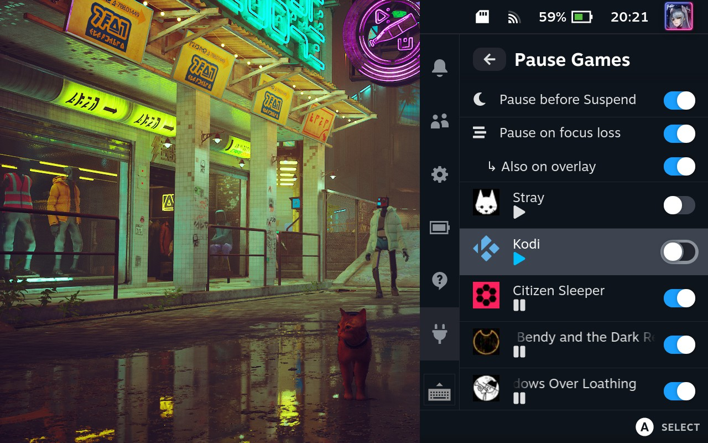

# Pause Games

A Steam Deck plugin for the [Decky Plugin Loader](https://github.com/SteamDeckHomebrew/decky-loader) that makes it possible to pause and resume games even for those that don't have an immediate pause option.

Useful for when you wish to temporarily suspend an application in order to redirect the cpu and gpu ressources to another without having to close it.

Since used RAM and VRAM won't be able to be recovered from paused apps you might look into tweaking your swapfile to make things smoother: https://github.com/CryoByte33/steam-deck-utilities

It sends the `SIGSTOP` signal to all the children of the reaper process to stop the execution and `SIGCONT` to resume them. ([Signal (IPC)](https://en.wikipedia.org/wiki/Signal_(IPC)))

It also allows to pause all games prior to system suspend which seems to fix some issues with crackling audio or freezing emulators.

The **Pause on focus loss** feature will automatically pause apps that are not in focus when switching between them. A bit like the Xbox quick-suspend/resume feature (without the dump to disk functionality unfortunately). If you manually change the state of an app (pause/resume) in this mode it will be stickied and not change state automatically anymore on focus change (depicted by a blue play/pause icon). To reset the stickied states, disable and re-enable **Pause on focus loss**.

In addition to **Pause on focus loss**, **Also on overlay** will also pause apps when the Steam Overlay is on (by pressing the **STEAM** button).

## Known Issues

- some games may not like being stopped and resumed too many times over extended periods of play while others work without issues. Make sure to save often if you intend to switch between games with the **Pause on focus loss** feature enabled.
- some games may stop responding to input once they are resumed which could be an issue related to the Steam Client getting confused between different control layouts used by the running games. Sometimes force resuming or closing another running game can fix the input issue.

## Future ideas

- options to terminate and force kill more "thoroughly" and immediately a process tree
- checkpoint/restore support with [CRIU](https://github.com/checkpoint-restore/criu) to make it possible to dump and restore a game to/from disk (savestates)
  + I already conducted some experiments but the biggest hurdle are the sockets and dri devices which would require many interdependant processes to be checkpointed too
  + A completely isolated process and resource tree seems to be the only viable way currently to get something working (see podman/docker checkpoint/restore) but even then there are host only sockets (pipewire, wayland, xorg) that would need to be taken into account too for games to work

## Usage Examples

- https://www.reddit.com/r/SteamDeck/comments/z6n047/32_gig_swap_file_pause_game_plugin_xbox_quick/
- https://www.youtube.com/watch?v=_yBSRyvyqg4

## Tips

- If you use yuzu (https://yuzu-emu.org/) and want to enable the **Pause on focus loss** feature, make sure to enable **Pause emulation when in background** under **General** Settings in yuzu in order to prevent potentially freezing the emulator completely. You can also Pause/Resume the emulation by binding **F4** to a key and press it just before pausing or after resuming the game with the plugin.